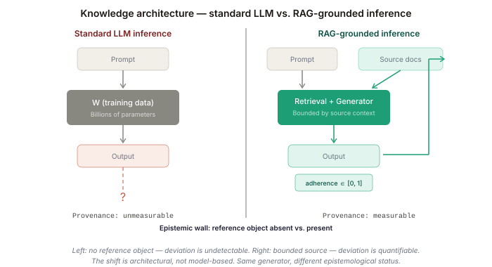
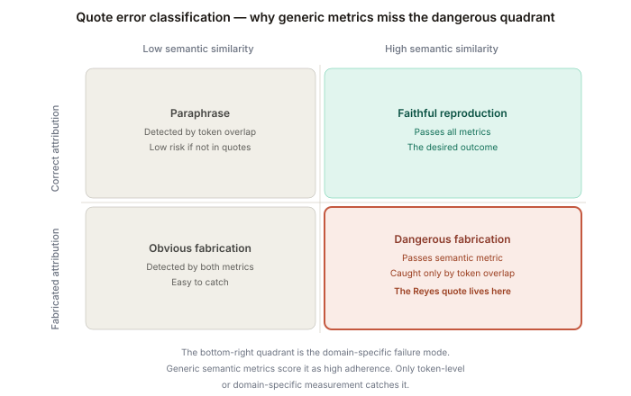
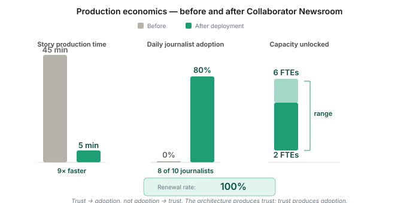
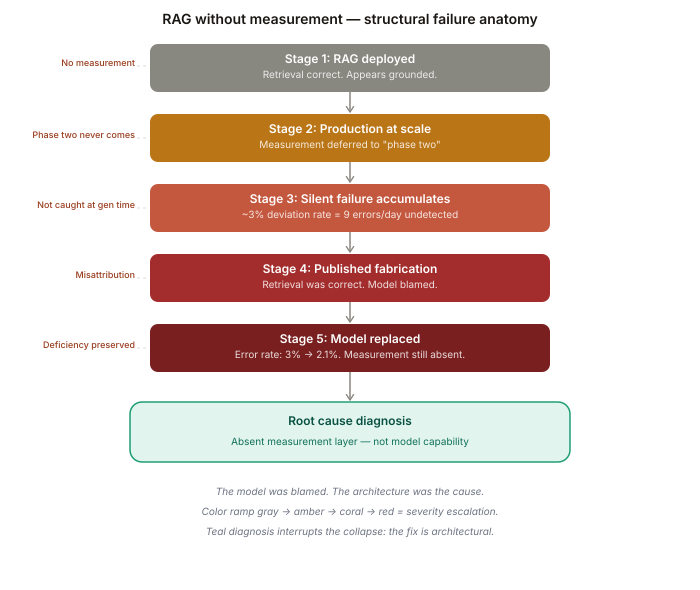
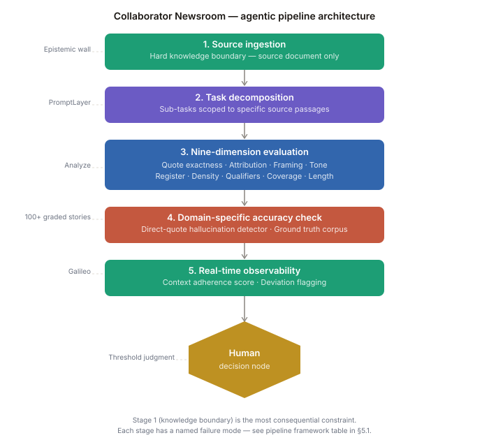
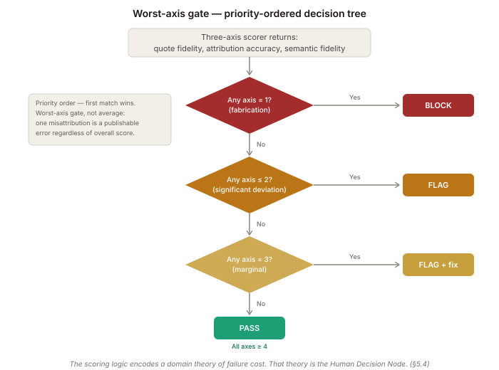
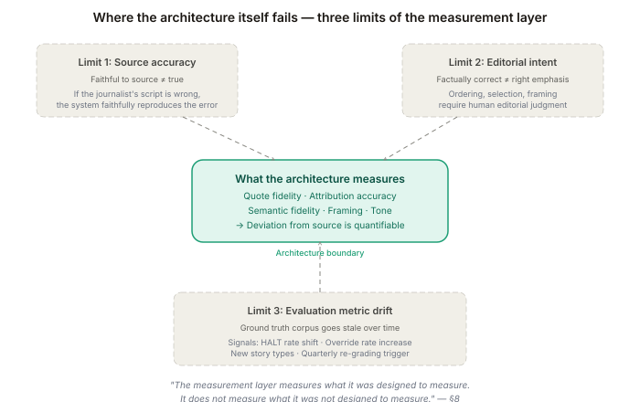

# Chapter 09: Grounding Agents in Evidence

## Magid's Newsroom RAG System

**Design of Agentic Systems with Case Studies**

*Aravind Balaji — INFO 7375: Prompt Engineering for Generative AI*

---

## Learning Outcomes

After reading this chapter, a student will:

1. **Explain** why RAG is not a search optimization but a fundamental epistemological constraint that determines whether an agent's outputs can be trusted as evidence-grounded (Bloom's: Understand).
2. **Analyze** how Magid's architectural journey — from single-shot prompting to agentic RAG workflows — demonstrates that context adherence is a measurable production property, not an aspiration (Bloom's: Analyze).
3. **Implement** a RAG pipeline with measurable context adherence scoring that detects direct-quote hallucinations and source deviation — the architectural pattern Magid deployed across hundreds of newsrooms (Bloom's: Apply).
4. **Evaluate** the failure mode that emerges when RAG is treated as search optimization rather than epistemological constraint: the system produces fluent, citation-bearing outputs that misrepresent sources — a failure undetectable without an observability layer (Bloom's: Evaluate).
5. **Design** a domain-specific RAG evaluation framework that goes beyond generic RAGAS metrics to capture the nuanced requirements of a specific production domain (Bloom's: Create).

### ABET Evidence Mapping

| Outcome | Evidence-Generating Activity | Student Deliverable |
|---|---|---|
| 1. Explain (Understand) | Chapter reading + worked example | Written analysis distinguishing RAG-as-search from RAG-as-epistemological-constraint |
| 2. Analyze (Analyze) | Activity 9.1: Auditing a RAG system's knowledge boundary | Two-page analysis specifying boundary policy, violation rate, and architectural fix |
| 3. Implement (Apply) | Notebook Parts 3-6: Naive vs. scored pipeline | Runnable notebook with both pipelines, retroactive scoring, per-quote gap analysis |
| 4. Evaluate (Evaluate) | Activity 9.4: LLM-assisted failure chain analysis | Annotated failure chains with causal validity assessment against documented ground truth |
| 5. Design (Create) | Activity 9.3: Trustworthy agentic system design | Complete architecture document with knowledge boundary, evaluation dimensions, and human review interface |

---

## Core Claim

> After reading this chapter, a student will understand **RAG as an epistemological constraint on agent outputs** well enough to **design a RAG system with measurable context adherence and domain-specific hallucination detection** without making the mistake of **treating RAG as a search quality optimization and assuming that retrieved context guarantees faithful generation**.

The book's master argument: **architecture is the leverage point, not the model.** This chapter is a specific instance of that argument. Magid's Collaborator Newsroom does not succeed because it uses a better LLM. It succeeds because its architecture — RAG grounding, agentic orchestration, domain-specific evaluation, and real-time observability — transforms LLM outputs from unverifiable text into evidence-traceable journalism. Without that architecture, the same model produces fluent content that journalists cannot trust. The model is identical. The architecture makes it trustworthy.

**RAG is not a search optimization — it is a fundamental epistemological constraint that determines whether an agent's outputs can be trusted as evidence-grounded. Without RAG, LLM agents confabulate with high confidence. With RAG, agent outputs are traceable to sources and deviations are detectable. Context adherence is a measurable property, not an aspiration.**

---

## 1. The Scenario: When Fluency Is Not Enough

On a Tuesday afternoon in a regional television newsroom, a journalist finished writing the broadcast script for a story about a city council vote on housing density. The script was tight, well-sourced, and ready for air. She handed it to the station's new AI-powered versioning tool and asked it to produce a web story and a social media teaser. Forty seconds later, both were ready. The prose was clean. The tone was right. And the web version contained a direct quote that the council member had never said.

The quote was plausible — it sounded like something a politician discussing housing might say. But the journalist's script had described the council member as "stopping short of endorsing the rezoning." The AI rendered this as a direct quote expressing support. The valence was reversed. The attribution was fabricated. Nothing in the output's surface texture — its grammar, its formatting, its professional tone — signaled that anything had gone wrong.

The journalist caught the error because she happened to re-read the output before filing. She had no systematic process for detection — no metric, no threshold, no audit log. She could not know how many outputs she *had not* re-read that contained similar errors.

In another case, the same tool correctly extracted a statistic but attributed it to the wrong source; in a third, it merged facts from two separate paragraphs into a single sentence that changed the meaning. None of these errors would be caught by a grammar checker, a tone analyzer, or even a generic "hallucination detector." They required someone to compare the output against the original source material, sentence by sentence, checking whether every claim in the generated text was traceable to a specific passage in the input.

That asymmetry — the gap between how often the system fails and how often those failures are caught — is the architectural problem this chapter addresses. A newsroom that produces three hundred versioned stories per week at a three percent deviation rate generates nine errors weekly. Most will not be caught before publication. The ones that are caught arrive as complaints, corrections, and credibility damage — costs that compound long after the story has been filed.

This is the problem that Magid — a 70-year-old consumer intelligence and strategy consulting firm — set out to solve with Collaborator Newsroom. And the architectural decision that made it work was not a better model, a better prompt, or a better retrieval algorithm. It was the decision to treat RAG not as a search optimization but as an **epistemological constraint**: a system-level guarantee that every claim in the output is traceable to a specific passage in the journalist's source material, and that deviations from source are detectable, measurable, and flaggable in real time.

---

## 2. The Mechanism: RAG as Epistemological Constraint

### 2.1 The Epistemological Problem with Ungrounded Generation

An LLM without RAG operates in what epistemologists call an *unverifiable knowledge state*. It generates text that may or may not correspond to reality, and there is no systematic mechanism to check. The model's outputs carry no provenance — they cannot be traced to a source, and deviations from any ground truth cannot be detected programmatically.

This is not a practical inconvenience. It is a categorical limitation. In domains where trust depends on traceability — journalism, legal analysis, medical documentation, financial reporting — an unverifiable output is not merely "less useful." It is *unusable*. A news story that cannot be traced to sources is not journalism. A legal brief that cannot be traced to statutes is not legal reasoning. The output may be fluent, grammatical, and persuasive. But it cannot be trusted.

RAG changes the epistemological status of agent outputs. When an agent generates text from retrieved source material, two things become possible that are impossible without RAG:

**Source traceability**: Every claim in the output can be mapped back to a specific passage in the retrieved context. If the output says "The council voted 7-2 to approve the rezoning," the system can verify that this claim appears in the source material the agent was given.

**Deviation detection**: When the output diverges from the source — when it adds information not in the context, alters a quote, changes an attribution, or shifts the meaning of a statistic — this divergence is *detectable*. Not because a human reads both texts, but because an automated system can compare the output against the retrieved context and measure the degree of adherence.


*Figure 1: Left — no reference object; provenance is unmeasurable. Right — bounded source documents make context adherence quantifiable. The shift is architectural, not model-based.*

This is what the chapter's core claim means: **context adherence is a measurable property, not an aspiration.** It can be scored, tracked over time, compared across model versions, and used to trigger alerts when it drops below a threshold. Let's make that measurement concrete using the fabrication from the chapter's opening.

### Worked Example: The Fabricated Quote — Two Metrics, One Lesson

Return to the newsroom. The journalist's broadcast script contained:

> **Source:** Councilmember Reyes stopped short of endorsing the rezoning, saying the proposal needed "more community input" before she could support it.

The versioning tool generated:

> **Output:** "I support bringing more housing to this neighborhood," said Councilmember Reyes, who backed the measure pending additional review.

The output is fluent and contextually plausible. Reyes is mentioned, housing is discussed, and the tone matches a news story. Now apply two deviation measurements.

**Metric 1 — Token Overlap (Jaccard Similarity)**

```
Source tokens: {councilmember, reyes, stopped, short, endorsing, rezoning,
               saying, proposal, needed, more, community, input, before, 
               she, could, support, it}  →  17 tokens

Output tokens: {i, support, bringing, more, housing, to, this, neighborhood,
               said, councilmember, reyes, who, backed, the, measure, 
               pending, additional, review}  →  18 tokens

Intersection: {councilmember, reyes, more, support}  →  4 tokens
Union: 31 tokens

Jaccard similarity  =  4 / 31  =  0.129
Token-overlap deviation  =  1 − 0.129  =  0.871
→  Threshold > 0.5:  FLAGGED ✓
```

The specific words of hedging — *stopped, short, needed, before, could* — are absent from the output. Token overlap catches this because the fabrication uses different words to say something different.

**Metric 2 — Semantic Similarity (Embedding Cosine)**

```
Source encodes: hedging, conditional support, deference to community
Output encodes: affirmative support, endorsement, forward momentum

Cosine similarity  ≈  0.81  (illustrative — actual value depends on 
                              embedding model and dimensionality)
Semantic deviation  =  1 − 0.81  =  0.19
→  Threshold > 0.5:  NOT FLAGGED ✗
```

Both sentences discuss the same topic (housing rezoning), the same person (Reyes), the same vote. The embedding captures topical coherence. It does not capture that "stopped short of endorsing" and "I support" are *opposites*. The cosine value of 0.81 is illustrative — actual scores depend on embedding model and dimensionality — but the pattern it demonstrates holds across implementations: topically coherent fabrications score high on semantic similarity regardless of directional valence.

**The Gap**

```
Token-overlap deviation:   0.871  →  FLAGGED
Semantic deviation:        0.190  →  NOT FLAGGED
Delta between methods:     0.681
```

**Why the gap is the lesson, not the score.** The fabricated output is semantically close to the source — same topic, same person, same register. Embedding-based similarity captures topical coherence. It does not capture directional valence, attribution exactness, or the categorical difference between hedging and endorsement. Token overlap catches the fabrication because the specific words of hedging are absent. Neither metric alone is sufficient. A system that uses only semantic similarity will pass fabricated quotes at a high rate because fabricated quotes are, by construction, topically coherent with their source. The domain-specific failure mode is invisible to the domain-agnostic metric.


*Figure 3: The same fabricated quote measured two ways. Token overlap flags it (0.871). Semantic similarity misses it (0.190). The 0.681 gap is why domain-specific metrics are architecturally necessary.*


*Figure 5: The bottom-right quadrant — high semantic similarity, fabricated attribution — is the dangerous failure mode. Generic metrics score it as high adherence. Only token-level or domain-specific measurement catches it.*

### 2.2 Why Single-Shot Prompting Failed at Magid

Before building Collaborator Newsroom as a RAG system, Magid's clients experimented with off-the-shelf, single-shot prompting tools. The results illustrate why RAG is architecturally necessary, not merely beneficial.

The single-shot approach was straightforward: paste a broadcast script into an LLM, ask it to produce a web story. The problems were structural:

**Inconsistency**: The same script, prompted twice, produced different outputs. One version might include a quote; the other might paraphrase it. One might lead with the most newsworthy fact; the other might bury it. As Magid's AI Product Manager Stephanie Smelewski noted: "It was super inconsistent — single-shot prompting just wasn't doing it."

**The inconsistency loop**: Fixing one flaw in the prompt created two new ones. Telling the model to always include direct quotes caused it to fabricate quotes when the source didn't contain any. Telling it to maintain the original story structure caused it to ignore platform-specific formatting requirements (social posts shouldn't read like broadcast scripts). The prompt became a patch-on-patch structure that was unmaintainable.

**The context window mirage**: Even models with large context windows could not reliably handle the multi-step task. The model had to simultaneously: extract facts, preserve quotes exactly, detect opinion vs. fact, evaluate bias, maintain brand voice, format for the target platform, and produce engaging copy. Each dimension interfered with the others. Large context windows provided the *capacity* for complex tasks but not the *architecture* to decompose them.

The architectural lesson: **the problem was not the model's capability. It was the absence of structure.** A single LLM call cannot simultaneously retrieve, evaluate, transform, and verify. These are distinct operations that require distinct architectural stages — which is what RAG and agentic orchestration provide.

### 2.3 The Architectural Decision: From Single-Shot to Agentic RAG

Magid's architectural solution decomposed the single-shot problem into an agentic pipeline with five stages:

**Stage 1 — Source Ingestion and RAG Grounding**: The journalist's original source material (broadcast script, reporter notes, press release, official document, audio/video transcription) is ingested as the *sole* knowledge base. Collaborator works *exclusively* from the journalist's input. It does not access external databases, the internet, or pre-trained knowledge. This is the epistemological constraint in action: the system's knowledge boundary is the source material provided by the journalist.

**Stage 2 — Agentic Task Decomposition**: Rather than asking one LLM call to do everything, the system orchestrates multiple specialized agents via PromptLayer. One agent extracts facts and quotes. Another transforms content for the target platform. Another checks for bias and balance. Each agent reads from the grounded source context — not from the previous agent's output (avoiding the chain-contamination problem described in Chapter 7 on supervisor architectures).

**Stage 3 — The Analyze Layer (Nine-Dimension Evaluation)**: Every output passes through an eight-to-nine step evaluation workflow — Collaborator's "Analyze" engine — that scores content on dimensions including fairness, balance, clarity, engagement, bias detection, readability, and source fidelity. This is not post-hoc review. It is a structural component of the pipeline that runs on every story.

**Stage 4 — Accuracy Check (Domain-Specific Hallucination Detection)**: Collaborator includes the first industry-specific hallucination detection framework for journalism. It goes beyond generic context adherence metrics (like RAGAS) to catch domain-specific failures: direct-quote hallucinations (generated quotes that don't appear in the source), source misattribution (correct fact, wrong attribution), and semantic drift (facts from two sources merged into a single misleading claim). Generic evaluation metrics miss these because they weren't designed for the nuances of journalistic content.

**Stage 5 — Real-Time Observability (Galileo Integration)**: Every input and output passes through Galileo's observability platform, providing production monitoring of tone, factual accuracy, and format adherence. Custom metrics — tailored to each newsroom's standards — track quality in real time. This is context adherence as a measurable, monitored production property.

---

## 3. The Design Decision: What Magid Built and What It Costs

### 3.1 The Knowledge Boundary Decision

The most consequential design decision in Collaborator Newsroom is not which retrieval algorithm to use. It is the decision to **restrict the agent's knowledge boundary to the journalist's source material**.

This means Collaborator never generates content from the LLM's pre-trained knowledge. It never adds context "helpfully" from its training data. If the journalist's script mentions a city council vote but does not include the council member's title, Collaborator will not fill in the title — even if the LLM "knows" it. The system produces content that is faithful to the input, even at the cost of completeness.

This is a design trade-off. The system is less "helpful" than an unconstrained LLM. But it is more *trustworthy*. In journalism, trust is the product. The architectural decision to constrain the knowledge boundary is what makes the system deployable in a domain where a single fabricated quote can destroy a newsroom's credibility.

### 3.2 Custom Evaluation Over Generic Metrics

Magid discovered that generic RAG evaluation metrics — RAGAS context adherence scores, for example — are insufficient for domain-specific production. Generic metrics miss:

**Direct-quote exactness**: A generic metric might score "The mayor said 'we will move forward'" and "The mayor said 'we plan to move forward'" as high-adherence. In journalism, the difference is a misquote — potentially libelous.

**Attribution precision**: A generic metric checks whether a fact appears in the source. It does not check whether the fact is attributed to the correct source within the document. "According to the police report" and "according to witnesses" are different attributions for the same fact, with different journalistic implications.

**Bias and framing**: Generic metrics do not detect when the re-versioned content shifts the framing of a story — emphasizing one side of a controversy more than the original, or burying a qualifying statement that appeared prominently in the source.

Magid's solution: build a custom evaluation dataset of 100+ human-graded stories per station. Use these as ground truth. Run PromptLayer batch comparisons between production prompts and work-in-progress prompt revisions. Build custom metrics that check for misquoted citations, attribution accuracy, and framing fidelity — not just generic "context adherence."

This is the architectural lesson: **context adherence is measurable, but the measurement must be domain-specific.** The generic metrics are a starting point, not a solution.

### 3.3 The Canonical Failure: IBM Watson for Oncology

The consequences of deploying without domain-specific evaluation are not hypothetical. IBM's Watson for Oncology was deployed at MD Anderson Cancer Center in 2017 as a clinical decision support system. Watson retrieved clinical guidelines and generated treatment recommendations. Its aggregate evaluation metrics — measured against benchmark datasets at Memorial Sloan Kettering, where it was trained — appeared acceptable. But those benchmarks were constructed from synthetic patient scenarios: hypothetical cases built by physicians, not real clinical encounters from the institution where Watson would operate.

The failure was architectural, not model-based. Watson had no evaluation corpus built from MD Anderson's actual patient population, treatment protocols, or institutional practices. When it generated treatment recommendations for real patients, some were unsafe — but the evaluation layer had no mechanism for detecting this, because it was calibrated against the wrong ground truth. The system was not wrong in the way its metrics measured it. It was wrong in the way that mattered for its deployment context. The evaluation architecture had no mechanism for making that failure visible.

This is structurally identical to the newsroom problem. Generic evaluation metrics (Watson's benchmark scores) can appear satisfactory while domain-specific failures (unsafe recommendations for a specific patient population) go undetected. The fix in both cases is the same: evaluation metrics must be built from the deployment domain's actual failure modes, validated against domain-specific ground truth, and monitored in real time. Magid's 100+ human-graded stories per station is the journalistic equivalent of what Watson lacked: an evaluation corpus calibrated to the institution where the system operates.

### 3.4 The Disaggregation Problem: Amazon Rekognition

Watson demonstrates what happens when the evaluation corpus is built from the wrong population. Amazon Rekognition demonstrates a structurally distinct failure: what happens when aggregate metrics mask disaggregated failure modes. When the city of Orlando deployed Rekognition for facial recognition in 2018, the system's aggregate accuracy appeared acceptable on benchmark datasets. But external researchers applied demographic disaggregation to the same evaluation data and found systematic failure rates on darker-skinned faces that the aggregate score had averaged away. The system was not wrong in the way its metrics measured it. It was wrong in the way that mattered for its deployment context — and the evaluation architecture had no mechanism for making that failure visible.

The structural parallel to RAG evaluation is precise. A generic context adherence score that averages across all stories will appear acceptable even if the system systematically fails on a specific category — stories with direct quotes, stories requiring attribution precision, stories with qualifying statements. The aggregate score masks the disaggregated failure, exactly as Rekognition's aggregate accuracy masked the demographic failure. Magid's nine-dimension evaluation is a form of disaggregation: instead of one adherence score, nine separate scores ensure that a failure on any single dimension is visible rather than averaged away. The lesson generalizes: any evaluation metric that reports a single aggregate number over a heterogeneous population of outputs is vulnerable to the disaggregation problem.

### 3.5 The Production Economics

Magid's architecture has measurable production outcomes:

- **Story production time**: 45 minutes → 5 minutes for complete re-versioned stories
- **Capacity gain**: 2-6 FTEs of capacity unlocked per newsroom
- **Adoption**: 8 out of 10 journalists who try Collaborator become daily users
- **Retention**: Every customer that bought has renewed
- **Scale**: Thousands of stories per day across local and national newsrooms

These economics work because the architecture — not the model — enables production deployment. A better model without the Analyze layer, the Accuracy Check, and the observability integration would produce faster outputs that journalists couldn't trust. Trust is the bottleneck. The architecture produces trust.


*Figure 7: Trust produces adoption, not the reverse. The architecture's measurable trustworthiness is what drives the 9× speed improvement, 80% daily adoption, and 100% renewal.*

---

## 4. The Failure Case: When RAG Is Treated as Search Optimization

### 4.1 Defining the Failure

The failure mode this chapter demonstrates is what happens when a team treats RAG as a *search quality improvement* rather than as an *epistemological constraint*. The system retrieves relevant context, passes it to the generator, and produces output. But there is no measurement of context adherence. No detection of source deviation. No observability layer tracking whether the output actually reflects the source.

The result is not a system that doesn't work. The result is a system that *appears* to work — producing fluent, professional-sounding outputs that sometimes misrepresent their sources in ways that are undetectable without line-by-line human comparison.

### 4.2 The Causal Chain

**Link 1 — RAG without observability**: The team builds a standard RAG pipeline: ingest documents, embed them, retrieve relevant chunks, generate responses. The pipeline "works" — outputs are relevant, well-formatted, and cite sources.

**Link 2 — No context adherence measurement**: There is no systematic check between the retrieved context and the generated output. The team assumes that because the context was retrieved correctly, the generation must be faithful. This assumption is wrong. The generator may paraphrase a quote (changing its meaning), merge facts from different sources (creating a false implication), or add "helpful" context from its training data (introducing ungrounded claims).

**Link 3 — Domain-specific errors escape generic detection**: If the team uses generic hallucination detection (e.g., "does the output contain information not in the context?"), it may catch outright fabrications but miss domain-specific failures: misquotation, misattribution, framing shift, and semantic drift. These are the errors that matter most in journalism, law, and medicine — and they are the errors that generic metrics were not designed to detect.

**Link 4 — Confidence without verification**: The system's outputs look trustworthy — they cite sources, use professional language, and match the input topic. Users begin to trust the system. But the trust is unearned because no measurement validates it. When a misquotation reaches publication, the damage is done — and the team cannot identify *when* the failure mode began because they have no historical observability data.

**Link 5 — The model gets blamed, but the architecture is the cause**: The team's diagnosis is "the model hallucinated." They upgrade to a more powerful model. The misquotation rate decreases slightly but does not disappear — because the root cause was never the model. It was the absence of an architectural layer (domain-specific context adherence measurement) that would have detected and flagged the deviation before it reached publication.


*Figure 4: Each stage is a missed architectural intervention. Color ramp (gray → amber → coral → red) tracks severity escalation. The teal diagnosis interrupts the collapse: the fix is architectural, not model-based.*

### 4.3 Triggering the Failure in the Demo

The accompanying notebook implements two RAG pipelines for newsroom content re-versioning:

**Pipeline A — RAG-as-Search (No Adherence Measurement)**: Standard RAG pipeline that retrieves the journalist's source material and generates a web story. No context adherence scoring. No quote verification. No observability.

**Pipeline B — RAG-as-Epistemological-Constraint (Magid's Architecture)**: Same retrieval, but with a context adherence scoring layer that measures quote fidelity, attribution accuracy, and semantic drift. Outputs are scored. Deviations are flagged. A "Fix It" mechanism is triggered when adherence drops below threshold.

Both pipelines produce outputs. Pipeline A's output *looks* as good as Pipeline B's. The difference is only visible when you measure context adherence — and the demo includes an automated comparison that shows where Pipeline A's output deviates from the source in ways that Pipeline B detects and flags.

The reader's exercise: run both pipelines on a source script that contains three direct quotes and two statistics. Compare the outputs. Then check the adherence scores. Pipeline A will have at least one misquotation or misattribution that Pipeline B catches.

---

## 5. The Implementation: A Measurable Context Adherence Pipeline

### 5.1 Architecture Overview

```
Journalist's Source Material
  │
  ▼
┌─────────────────────┐
│  Source Ingestion    │  Parse scripts, notes, transcripts
│  (Knowledge Boundary)│  ← ONLY source material, no external data
│                     │  ⚠ FAILURE: boundary not enforced → model draws on training data
└──────────┬──────────┘
           │
           ▼
┌─────────────────────┐
│  Chunking +         │  Structure-aware chunking
│  Embedding          │  Quote-preserving boundaries
│                     │  ⚠ FAILURE: quote split across chunks → token verification breaks
└──────────┬──────────┘
           │
           ▼
┌─────────────────────┐
│  RAG Retrieval      │  Source chunks → generator context
│                     │  ⚠ FAILURE: relevant chunk not retrieved → missing evidence
└──────────┬──────────┘
           │
           ▼
┌─────────────────────┐
│  Agentic Generation │  Platform-specific agents
│  (PromptLayer)      │  (web, social, push, summary)
│                     │  ⚠ FAILURE: paraphrase-as-quote, attribution shift, framing drift
└──────────┬──────────┘
           │
           ▼
┌─────────────────────┐
│  CONTEXT ADHERENCE  │  Quote fidelity scoring
│  MEASUREMENT        │  Attribution verification
│  (Accuracy Check)   │  Semantic drift detection
│                     │  ← HUMAN DECISION NODE
│                     │  ⚠ FAILURE: scorer miscalibrated → false-proceed on real deviations
└──────────┬──────────┘
           │ (pass/flag)
           ▼
┌─────────────────────┐
│  OBSERVABILITY      │  Real-time monitoring (Galileo)
│  (Production)       │  Custom per-newsroom metrics
│                     │  ⚠ FAILURE: metrics not reviewed → silent degradation over time
└─────────────────────┘
```


*Figure 2: Five sequential stages terminating in a human decision node. Stage 1 (knowledge boundary) is the most consequential constraint — it makes every subsequent measurement meaningful.*

**Pipeline Framework: Five Positions, Five Failure Modes**

Every agentic pipeline has the same five structural positions. Trustworthiness is determined by the design decisions at each position. A pipeline that omits any position does not lack a feature — it lacks a constraint.

| Pipeline Position | Magid's Design Decision | What Breaks Without It |
|---|---|---|
| **Knowledge Boundary** | Agent operates only on journalist's uploaded source. No external data, no pre-trained knowledge. | Model draws on training data; output contains claims untraceable to any source |
| **Retrieval + Decomposition** | PromptLayer orchestrates sub-tasks scoped to specific source passages | Single-shot prompting; inconsistency loop; nine-dimension interference |
| **Generation** | Platform-specific agents (web, social, push, summary) each with scoped context | One-size-fits-all output; platform-inappropriate formatting |
| **Evaluation** | Three-axis scorer (quote fidelity, attribution, semantic) + token-level quote check. *Tiered*: fast token check on all stories; full LLM scorer on flagged stories or high-risk topics (crime, legal, political) | Deviations ship undetected; the five-stage failure anatomy from Section 4 |
| **Observability** | Galileo real-time monitoring; per-newsroom custom metrics; deviation alerts | Silent quality degradation; no regression detection after prompt updates |

Note the **Evaluation** row: the tiered design from Section 7.3 means the diagram above shows two evaluation paths — a fast deterministic token check (runs on every story, sub-millisecond, no LLM) and a full three-axis LLM scorer (runs on flagged stories or high-risk topics). The architecture diagram shows a single box for clarity; the production system implements it as a two-tier gate.

### 5.2 The Context Adherence Scorer

```python
def context_adherence_scorer(source_text: str, generated_text: str, llm) -> dict:
    """Measure context adherence between source and generated output.
    
    This is the epistemological constraint in code: every claim in the
    generated text must be traceable to the source text.
    Returns scores on three domain-specific dimensions.
    """
    scoring_prompt = f"""You are a journalistic accuracy auditor. Compare the 
GENERATED OUTPUT against the ORIGINAL SOURCE MATERIAL.

ORIGINAL SOURCE:
{source_text}

GENERATED OUTPUT:
{generated_text}

Score on three dimensions (1-5 each):

QUOTE FIDELITY: Are all direct quotes in the output EXACTLY as they appear 
in the source? Any word change, even a synonym, scores lower. A fabricated 
quote that doesn't appear in the source at all scores 1.

ATTRIBUTION ACCURACY: Is every fact in the output attributed to the same 
source as in the original? If the source says "according to the police 
report" but the output says "according to officials," that is an 
attribution error.

SEMANTIC FIDELITY: Does the output preserve the meaning of the source? 
Check for: facts merged from different contexts, qualifying statements 
removed, emphasis shifted, implications changed.

Also list every specific deviation found.

Respond with JSON only:
{{"quote_fidelity": int, "attribution_accuracy": int, 
  "semantic_fidelity": int, "overall_adherence": float,
  "deviations": ["list each deviation"],
  "decision": "PASS" or "FLAG",
  "fix_suggestions": ["specific corrections needed"]}}

RULE: If any score < 3, decision MUST be FLAG.
RULE: Any fabricated quote is an automatic FLAG regardless of other scores."""

    response = llm.invoke(scoring_prompt)
    return parse_json_response(response)
```

### 5.3 The Mandatory Human Decision Node

```python
# ============================================================
# MANDATORY HUMAN DECISION NODE
# ============================================================
# The three-axis scorer assumes the LLM can reliably distinguish:
#   (a) faithful reproduction (meaning and quotes preserved)
#   (b) paraphrase-as-quote (meaning preserved, quote fabricated)
#   (c) semantic drift (meaning subtly altered)
#
# WHAT THE AI PROPOSED:
#   Bookie: "Use RAGAS context adherence scoring — embedding
#   cosine similarity between output and context."
#
# WHAT I CORRECTED:
#   The 0.681 gap proves this is insufficient. Cosine scores the
#   fabricated Reyes quote as HIGH adherence (same topic, person,
#   vote). Token overlap catches it (hedging words absent).
#   Three axes instead: quote fidelity, attribution accuracy,
#   semantic fidelity — each maps to a different architectural fix.
#
# VALIDATION PROCEDURE:
# 1. Run scorer on 50+ stories with known human-graded scores
# 2. Specifically test: does the scorer catch the fabricated
#    Reyes quote that semantic similarity (0.190 deviation) misses?
# 3. Calculate false-proceed rate (scorer says PASS, human says FLAG)
# 4. If false-proceed > 10%, add few-shot examples to scorer prompt
#
# Document your verification or rejection below:
# [ ] Scorer validated — false-proceed rate: ____%
# [ ] Scorer rejected — revision needed because: ________
# ============================================================

# HARD HALT — execution pauses until human types a decision
human_decision = input("Enter PASS or FLAG after reviewing scores: ")
print(f"Human decision recorded: {human_decision}")
```

The `input()` call is not a placeholder. It is a programmatic checkpoint: the notebook stops executing until the human reviewer types a decision. This is the architectural analog of Magid's Stage 5 review threshold — the point at which domain expertise, not computation, determines whether the output ships.

### 5.4 Worked Example: Multi-Dimensional Aggregate Scoring

The three-axis scorer produces three integers (1-5). How do these combine into a review-trigger decision? This is itself an architectural choice. Here is the scoring logic Magid's architecture implies:

```
Story: "City Council Approves Rezoning Plan" (web version from broadcast script)

Axis scores:
  Quote fidelity:       4/5  (one minor paraphrase, no fabrication)
  Attribution accuracy: 3/5  (one statistic attributed to "officials" instead of
                              "Regional Housing Authority")
  Semantic fidelity:    5/5  (meaning preserved, qualifiers retained)

Aggregate decision logic:
  IF any axis = 1 (fabrication detected)     → BLOCK (do not publish)
  IF any axis ≤ 2 (significant deviation)    → FLAG for human review
  IF all axes ≥ 4                            → PASS (auto-publish eligible)
  IF any axis = 3 (marginal)                 → FLAG with fix suggestion

This story: attribution = 3 → FLAG
Fix suggestion: "Replace 'according to officials' with
                 'according to the Regional Housing Authority' (source: paragraph 3)"
Estimated fix time: 15 seconds
```

The aggregate logic is not a weighted average. It is a **worst-axis gate**: the lowest-scoring axis determines the decision. This reflects a domain judgment — in journalism, a single misattribution is a publishable error regardless of how faithful the rest of the story is. Other domains might weight differently: a legal contract review might weight semantic fidelity highest (meaning preservation) while tolerating paraphrased quotes. The scoring logic encodes a theory of what failure means in the deployment domain. That theory is the Human Decision Node — it cannot be set by the agent because it requires understanding the institutional cost of each failure type.


*Figure 8: Three sequential decisions, each checking the lowest-scoring axis. BLOCK (any axis = 1), FLAG (any axis ≤ 2), FLAG+fix (any axis = 3), PASS (all axes ≥ 4). The logic encodes a domain theory of failure cost — it is the Human Decision Node in code.*

---

## 6. The Exercise: Remove the Adherence Layer

### 6.1 The Modification

Remove the context adherence scorer from the pipeline. Replace it with a passthrough that always returns PASS:

```python
def context_adherence_DISABLED(source_text, generated_text, llm):
    """BROKEN: No adherence check. All outputs pass."""
    return {
        "quote_fidelity": 5, "attribution_accuracy": 5,
        "semantic_fidelity": 5, "overall_adherence": 1.0,
        "deviations": [], "decision": "PASS",
        "fix_suggestions": []
    }
```

### 6.2 What Breaks

Run both the scored and unscored pipelines on a source script containing:
- Three direct quotes from named individuals
- Two statistics with specific attributions
- One qualifying statement ("however, critics argue...")

The unscored pipeline will likely produce output where at least one of these is altered. The alteration will be subtle — a paraphrased quote, a shifted attribution, a dropped qualifier. The output will *look* professional and cite the right topics.

Now run the adherence scorer on the unscored output. The scorer flags the deviations. The scored pipeline either produced the output correctly (because the scorer's presence in the pipeline guides generation through prompt design) or flagged the deviation and suggested a fix.

### 6.3 The Deeper Exercise

For readers who want to go further: replace the domain-specific adherence scorer with a generic RAGAS context adherence metric. Run on the same test set. Compare what each catches. The generic metric will score the misquotation case highly (the paraphrased quote is "semantically similar" to the original). The domain-specific scorer will flag it (the quote is not exact). This is why Magid built custom metrics.

---

## 7. Production Considerations

### 7.1 The Evaluation Ground Truth Problem

Magid's approach — 100+ human-graded stories per station as evaluation ground truth — is expensive but essential. Without human-graded ground truth, you cannot validate that your automated adherence scorer catches the failures that matter. The initial investment in human grading creates the dataset that makes automated evaluation possible.

### 7.2 Prompt Versioning as Architecture

Magid uses PromptLayer's version control to track every prompt change. When an adherence score drops after a prompt update, the team can compare the current prompt against the previous version and identify which change caused the regression. This is context adherence as a continuous monitoring property — not a one-time check.

### 7.3 Evaluation Cost at Production Scale

The three-axis scorer adds an LLM call between generation and delivery. At Magid's scale — hundreds of stories per day per newsroom, multiplied across dozens of stations — this is not a trivial cost. Each scoring call adds latency (1-3 seconds per story) and inference cost (the scorer prompt is as long as the generation prompt). The nine-dimension Analyze workflow is even more expensive: nine evaluation passes per story.

The architectural trade-off is latency-vs-trust. Three strategies mitigate the cost without removing the constraint: (1) Use a smaller, faster model for scoring — the scorer does not need to generate fluent prose, only evaluate fidelity, so Claude Haiku or a fine-tuned small model suffices. (2) Run the scorer in parallel with generation rather than sequentially — begin scoring as soon as the first output section is available, overlapping computation. (3) Tier the evaluation — run the fast token-level quote check (deterministic, no LLM, sub-millisecond) on every story; run the full three-axis LLM scorer only on stories where the token check flags a deviation or where the story's topic is classified as high-risk (crime, legal, political). This tiered approach processes most stories cheaply while reserving expensive evaluation for the stories most likely to need it.

The cost question connects directly to Chapter 14's dollar-per-decision metric: the evaluation layer's cost per story must be justified by the trust it produces. If a published misquotation costs the station ten thousand dollars in corrections and credibility damage, and the evaluation layer costs fifty cents per story, the economics are unambiguous. If the evaluation catches one fabrication per three hundred stories, it pays for itself on every run.

### 7.4 When RAG Is Not the Right Architecture

Chapter 26 argues — correctly — that teams should start simple: try a large context window before building a RAG pipeline. This chapter does not contradict that advice. It refines it. The question is not "does the source material fit in the context window?" (often it does — a broadcast script is short). The question is "does the architecture provide a reference object against which output fidelity can be measured?"

A large context window gives the model access to the source material. It does not give the system a mechanism for *measuring* whether the output faithfully represents that material. Capacity is not architecture. Magid's source documents often fit comfortably in a modern context window. They built a RAG architecture anyway — not because retrieval improved, but because RAG establishes the bounded knowledge state that makes context adherence computable.

RAG introduces complexity that may not be justified when:
- The domain does not require source traceability (creative writing, brainstorming)
- The cost of unfaithful generation is low (internal drafts, idea generation)
- No downstream system depends on the output's source fidelity

Magid's use case — public-facing journalism where a single fabricated quote can destroy credibility — is a domain where the RAG constraint is essential. The decision to use RAG should itself be an explicit architectural choice (as Chapter 26 argues), not a default. But the decision criteria should include "do I need to *measure* fidelity?" — not just "do I need better retrieval?"

---

## 8. Where the Architecture Itself Fails

The preceding sections present Magid's architecture as a resolution: hard knowledge boundary, domain-specific evaluation, real-time observability. The resolution is genuine — the system works at production scale and produces measurably trustworthy output. These are its limits.

Three failure modes remain invisible even within Magid's architecture:


*Figure 6: The teal center shows what the architecture measures. The three gray limits — source accuracy, editorial intent, metric drift — are what it cannot. Dashed arrows point toward what the center cannot see.*

### 8.1 When the Source Document Is Wrong

The entire measurement layer — quote fidelity, attribution accuracy, semantic fidelity — measures faithfulness to the source. It does not measure whether the source itself is accurate. If a journalist's broadcast script contains a factual error (a misremembered statistic, a misheard quote, an incorrect attribution), Collaborator will faithfully reproduce that error and the context adherence scorer will rate it as perfect. The system is faithful. It is not truthful. Fidelity to source and accuracy of source are independent properties, and the architecture measures only the first.

This is not a fixable limitation within the RAG architecture. It is a boundary condition of the epistemological constraint itself. RAG makes provenance *checkable* — "this claim came from that source" is a verifiable statement. The measurement layer is what enforces the check. But neither RAG nor measurement guarantees that the source is correct. Architectural alternatives exist — external fact-checking agents that cross-reference claims against wire services, systems that flag statements absent from other coverage, pipelines that compare the journalist's script against primary source documents before versioning. Magid deliberately chose not to build any of these, because each would require relaxing the knowledge boundary — drawing on information outside the journalist's document — which is the exact decision Magid rejected to preserve trustworthiness. The choice to accept source accuracy as a journalist's responsibility rather than a system's is itself an architectural decision: it trades the possibility of catching source errors for the certainty of never introducing external contamination. The trade-off is real and cannot be resolved architecturally. It requires the journalist to be right, and the system cannot verify that.

### 8.2 When the Failure Is Editorial, Not Factual

The three-axis scorer catches factual deviations: fabricated quotes, wrong attributions, altered statistics. It does not catch editorial failures that preserve all facts but change what the story *means*. A web version that leads with the dissenting vote rather than the majority approval is factually accurate — every claim is in the source — but editorially it tells a different story. Emphasis, ordering, and selection are editorial judgments that the nine-dimension Analyze layer partially captures (through its "framing fidelity" dimension) but cannot fully evaluate without understanding the journalist's intent.

This is the deeper version of the domain-specificity problem. Token overlap and semantic similarity measure textual properties. Editorial intent is not a textual property. It is a judgment about what matters, and that judgment lives in the journalist's head — not in the document. An architecture that measures everything measurable still misses everything that requires understanding intent. The human decision node at Stage 5 is the architectural acknowledgment of this limit: some judgments cannot be delegated to the agent.

### 8.3 When the Evaluation Metrics Themselves Drift

Magid's ground-truth corpus — 100+ human-graded stories per station — is static once constructed. The evaluation dimensions were designed for a specific moment in time. But journalistic standards evolve. New story types emerge (AI-generated content about AI, for instance). The audience's expectations shift. A ground-truth corpus from 2024 may not capture the failure modes that matter in 2026. If the evaluation metrics are not themselves re-evaluated periodically, the system will optimize for yesterday's definition of trustworthiness while today's failures go unmeasured.

This is a meta-architectural problem: who evaluates the evaluators? The architecture has no built-in answer. Three signals indicate that evaluation metrics have drifted: (1) the HALT rate changes significantly without a corresponding change in model or prompt — suggesting the ground-truth corpus no longer represents the distribution of stories the system processes; (2) human overrides of the scorer's decisions increase — the scorer says PASS but editors flag issues, or the scorer says FLAG but editors find nothing wrong; (3) new story types emerge that the evaluation dimensions were not designed to assess (AI-generated content, multimedia summaries, real-time event coverage). When any of these signals appears, the ground-truth corpus needs re-grading — not by re-running the old rubric on new stories, but by convening domain experts to ask whether the rubric's dimensions still capture the failures that matter.

Magid's operational practice — weekly iteration on the Analyze dimensions via PromptLayer, continuous refinement of custom metrics — is a process answer, not an architectural one. The system's trustworthiness depends on ongoing human judgment about what trustworthiness means, and that judgment cannot be automated. The re-evaluation cadence is itself a design decision: quarterly re-grading of the ground-truth corpus, with a trigger for immediate review when human-override rate exceeds a threshold, is a starting point. But the threshold must be set by someone who understands the institutional cost of each failure type — which is, once again, the Human Decision Node.

These three limits do not invalidate the architecture. They define its boundaries. A student who understands the Magid architecture but not its limits will deploy it confidently in a domain where the source documents are unreliable, the failures are editorial rather than factual, or the evaluation metrics have drifted — and the architecture will report perfect scores while the system silently fails. The measurement layer measures what it was designed to measure. It does not measure what it was not designed to measure. Knowing the difference is the architectural judgment this chapter is designed to develop.

---

## 9. Connections to the Broader Book

- **Chapter 7 (Coordinator-Worker-Delegator Model)**: Magid's agentic orchestration via PromptLayer follows the coordinator-worker pattern — specialized agents for extraction, transformation, and evaluation, orchestrated by a central pipeline.
- **Chapter 5 (Memory Is the Product)**: Magid's per-newsroom brand voice customization is a form of long-term memory — the system "remembers" each station's style, voice, and standards across every story.
- **Chapter 15 (Measuring Trajectories, Not Just Outcomes)**: Magid's nine-dimension Analyze workflow evaluates the trajectory (how the content was produced) not just the outcome (the final text). This aligns with trajectory evaluation principles.
- **Chapter 21 (Knowledge Without Boundaries)**: Chapter 21 argues that chunking strategy is the primary architectural decision in knowledge-intensive systems — *how* documents are segmented determines retrieval quality. This chapter takes that as given and asks the next question: once the chunks are retrieved, how do you know the generated output is faithful to them? Magid's knowledge boundary is not a chunking decision (the mechanics of chunking are covered in Chapters 21 and 27). It is an epistemological decision: the agent operates *only* on the journalist's source material, and deviations from that material are measurable. Chunking determines what gets retrieved. The knowledge boundary determines what counts as the ground truth against which output is evaluated.
- **Chapter 14 (What Gets Measured Gets Managed)**: Magid's Galileo integration is a direct instance of the dollar-per-decision metric: every story's adherence score translates to a trust metric that justifies the system's cost.
- **Chapter 24 (Four Ways Context Kills Agents)**: Chapter 24 classifies agentic failures as context failures, not model failures, and identifies five mechanistically distinct failure modes. The failure this chapter demonstrates — unfaithful generation from faithful retrieval — is a specific instance of **Context Confusion**: the context is correct and present, but the agent's output diverges from it in ways that are invisible without domain-specific measurement. The measurement layer this chapter advocates is the architectural defense against Context Confusion specifically. Context Poisoning and Context Distraction (other Ch 24 failure modes) require different mitigations; conflating them — as generic metrics do — produces interventions that fix the wrong problem.
- **Chapters 26–27 (RAG 101 and Configuring Your RAG Pipeline)**: Chapter 26 correctly argues that a large context window may suffice when retrieval quality is the concern — and that over-engineering RAG is the most common expensive mistake. This chapter's case study illustrates a domain where RAG's value is *not* retrieval quality (the journalist's document often fits in a single context window). RAG's value here is that it establishes the bounded reference object against which deviation is quantifiable. Context window capacity does not provide a measurement infrastructure. The mechanics of RAG pipeline configuration — chunking strategy, embedding model selection, indexing, querying, reranking — are covered in Chapter 27. This chapter focuses on what happens *after* retrieval: the measurement layer that determines whether the epistemological constraint RAG enables is actually enforced.

---

## 10. Summary

RAG is not a search optimization. It is a fundamental epistemological constraint that determines whether an agent's outputs can be trusted as evidence-grounded.

Without RAG, LLM agents confabulate with high confidence. With RAG, agent outputs are traceable to sources and deviations are detectable. But — and this is the architectural insight Magid's production deployment reveals — **traceability alone is not enough**. The system must also *measure* context adherence, using domain-specific metrics that catch the failures generic metrics miss. And it must *monitor* adherence in real time, using an observability layer that tracks quality across thousands of stories per day.

Magid's Collaborator Newsroom demonstrates this at production scale: thousands of stories daily, 2-6 FTEs of capacity unlocked per newsroom, 45-minute stories produced in 5 minutes, and every output scored for quote fidelity, attribution accuracy, and semantic fidelity.

The model is the same model available to any newsroom. The architecture — source-bounded RAG, agentic task decomposition, domain-specific evaluation, and real-time observability — is what makes it trustworthy. And understanding its limits — what it cannot measure, what it cannot catch, what it cannot evaluate without ongoing human judgment — is what makes the architectural reasoning complete.

Every design decision this chapter traces is a decision about one of the five structural positions in the pipeline framework: knowledge boundary, retrieval and decomposition, generation, evaluation, and observability. A pipeline that omits any position does not lack a feature — it lacks a constraint. And missing constraints produce unchecked failure modes.

**Architecture is the leverage point. The model is just what executes the architecture you designed.**

---

## References

1. Lewis, P. et al. — "Retrieval-Augmented Generation for Knowledge-Intensive NLP Tasks." NeurIPS 2020.
2. Galileo AI — "Magid Empowers Its Newsroom Clients with Galileo." Case Study, 2025.
3. PromptLayer — "How Magid Built Enterprise-Grade AI Agents for Content Creation." Case Study, August 2025.
4. Magid — "Collaborator Publisher: AI for Newsrooms." Product Documentation, 2025.
5. Magid — "Why ChatGPT Falls Short for Newsrooms — and How Collaborator Bridges the Gap." February 2025.
6. Gao, Y. et al. — "Retrieval-Augmented Generation for Large Language Models: A Survey." arXiv:2312.10997 (2024).
7. Shi, W. et al. — "Large Language Models Can Be Easily Distracted by Irrelevant Context." ICML 2023.
8. Barnett, S. et al. — "Seven Failure Points When Engineering a Retrieval Augmented Generation System." arXiv:2401.05856 (2024).
9. Es, S. et al. — "RAGAS: Automated Evaluation of Retrieval Augmented Generation." arXiv:2309.15217 (2023).
